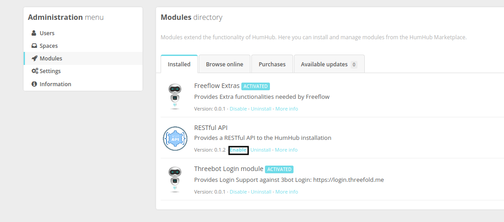

- freeflowpages is based on humhub opensource
- to build docker image run 
 
 ```
docker build -t threefolddev/freeflowpages:latest .
docker push threefolddev/freeflowpages:latest

  ```
- convert flist using threefold hub ( https://hub.grid.tf/docker-convert) so flist so flist gonna be
	 https://hub.grid.tf/bishoy.3bot/threefolddev-freeflowpages:latest.flist


## Fresh install on zos v2

1. create docker container 
```buildoutcfg
docker run -dit -p2205:22 -p805:80  --name freeflowpages_staging -e CLIENT_ID=freeflowpages -e CLIENT_SECRET=  -e DB_USER=humhub -e DB_PASS= -e AWS_ACCESS_KEY_ID= -e AWS_SECRET_ACCESS_KEY=your_aws_secret -e RESTIC_REPOSITORY=s3:https://s3.grid.tf/freeflowpages-staging -e RESTIC_PASSWORD=  -e SMTP_HOST=smtp.gmail.com -e SMTP_USER=  -e SMTP_PORT=587 -e threebot_stag=True  -e  SMTP_PASS=  -e HUMHUB_INSTALLATION_VERSION=1.5.2 -e THREEBOT_KEY_PAIR='' threefolddev/freeflowpages:latest

```

2. finish setup by access http://ip:port to set admin user, make admin email as your 3bot app email

3. restart docker container after setup to install remain modules and check logs
```buildoutcfg
    docker restart freeflowpages_staging
    docker logs -f freeflowpages_staging  
```
4. make sure appid according to your domain, if change applied, restart container then
```buildoutcfg
    docker exec -it freeflowpages_staging  bash
    vim /var/www/html/humhub/protected/modules/threebot_login/authclient/ThreebotAuth.php
```

```buildoutcfg
    'appid' => 'staging.freeflowpages.com'
```
5. enable Restful module, only Restful module need to enabled manually as below
    


 
## zos v1


## env variables 

```
'AWS_ACCESS_KEY_ID': 'aws-key-id',
 'AWS_SECRET_ACCESS_KEY': 'key',
 'CLIENT_ID': 'freeflowpages',
 'CLIENT_SECRET': 'iyo client id',
 'DB_PASS': 'humhub_db_user_to_connect_app_pass',
 'DB_USER': 'humhub_db_user_to_connect_app_username',
 'HUMHUB_INSTALLATION_VERSION': '1.3.15',
 'RESTIC_PASSWORD': 'restic pass',
 'RESTIC_REPOSITORY': 's3:https://s3.grid.tf/freeflowpages-stag-backup',
 'ROOT_DB_PASS': 'root db user password',
 'SMTP_HOST': 'smtp.sendgrid.net',
 'SMTP_PASS': 'smtp pass',
 'SMTP_PORT': '587',
 'SMTP_USER': 'apikey',
 'THREEBOT_KEY_PAIR': '3bot key par',
 'FFP_HOSTNAME':'staging.freeflowpages.com', # this will use in protected/modules/threebot_login/authclient/ThreebotAuth.php
 'threebot_stag': 'True'} # True in case use install freeflowpages as staging

```
## persistent data with below dirs

```
['/root/.ssh/', '/backup', '/var/www/html/humhub', '/var/mysql/binlog', '/var/lib/mysql/']

```

- to create containers and env got to below repo
  https://docs.grid.tf/threefold/itenv_threefold_main/src/branch/master/freeflowpages/
