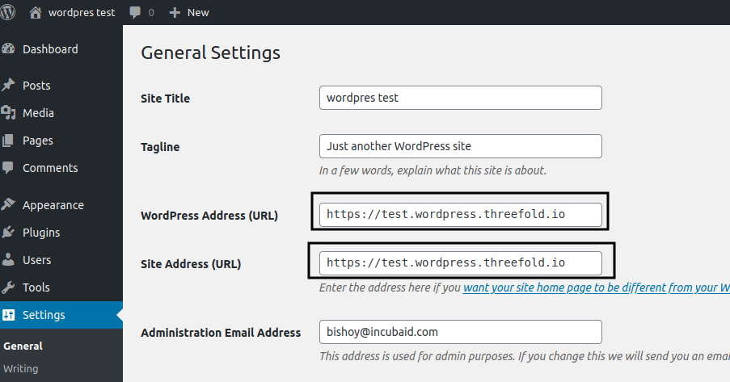

# Building 

in the wordpress directory

`docker build -t  bishoyabdo/wordpress .`

change bishoyabdo to whatever image name.

# Running

```
docker run --rm -ti -p 8080:80 -e MYSQL_ROOT_PASSWORD=password -e MYSQL_DATABASE=wordpress -e MYSQL_USER=wpuser -e MYSQL_PASSWORD=password \
-e WORDPRESS_DB_HOST=127.0.0.1 -e WORDPRESS_DB_USER=wpuser -e WORDPRESS_DB_PASSWORD=password -e WORDPRESS_DB_NAME=wordpress \
-v ~/wordpress/html:/var/www/html -v ~/wordpress/mysql_data:/var/lib/mysql bishoyabdo/wordpress /bin/bash 
```

- just use WORDPRESS_DB_HOST=127.0.0.1 not localhost, will check it later 
- MySQL database path in /var/lib/mysql, wordpress data in /var/www/html

## missing
- itsyou.online (low prio)

## ZOS flist 
    https://hub.grid.tf/mikhaieb/bishoyabdo-wordpress-latest.flist
    
## Caddyfile
            
    https://test.wordpress.threefold.io {
            proxy / 10.102.223.147:8080 {
                     transparent
            }
    }
    
    http://test.wordpress.threefold.io {
            redir https://test.wordpress.threefold.io{uri}
    }

- after configure https as above you need to change settings to use above link as below picture, login with http://10.102.223.147:8080 

    